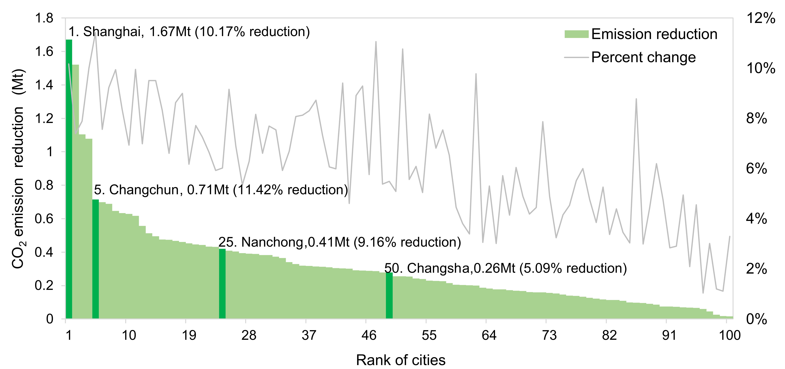

<div align="center">
  <h2><b>Big-Data Empowered Traffic Signal Control Could Reduce Urban Carbon Emissions</b></h2>
  <h4><b>Kan Wu, Jianrong Ding, Jingli Lin, Guanjie Zheng, Yi Sun, Jie Fang, Tu Xu, Yongdong Zhu, Baojing Gu†</b></h4>
  
[](https://doi.org/10.5281/zenodo.14591153) 
</div>
<br>



## Generation

You need to specify the following parameters for generation.
```
- The road net data of the city
- The city parameters
  - Population
  - Population density
  - Area size
```

The roadnet data required should be arranged in the form below.
```
./generator/<city name>/roadnet.txt
```  
As for the city parameters of the generation, you may use your custom data by modifying the file `citylist.xlsx`, which will be read while running `tripGenerator.py`. 

You may start generation by running the following command.
```
python tripGeneration.py
```
After generation, the flow data `flow.txt` and the information of flows `info.json` for each city will be stored in `./generator/<city name>`. After generating the flow data, you may test them by following our simulation process.

## Simulation

### Docker
Make a CBEngine docker environment via [CBEngine](https://cbengine-documentation.readthedocs.io/en/latest/content/cbengine/cbengine.html#using-docker). Follow the installation guide and create a docker container. Note that you are also required to install package `multiprocessing` as we used it to speed up simulation.

Then copy the simulation part of this repository to your docker container.
```
docker cp -r ./simulation CONTAINER:/
```
Start the docker container and enter the project directory
```
docker exec -it CONTAINER bash
cd simulation
```
### Datasets
The dataset `/simulation/dataset_rush/<city name>/` contains the following part. All the data are generated using the data generator that we had mentioned in the first part.

- **roadnet.txt**
The city's roadnet data contains information of roads, intersections and lanes.
- **flow.txt**
The traffic flow that is close to the real-world speed data from 7 a.m. to 9 a.m. In the form of starting time, end time, interval, and road ids in the route for each route.
- **flow`NUM`.txt**
The traffic flow that adds `NUM %` more vehicles to `flow.txt`, the format is the same with `flow.txt`

Note that `config.json` and `engine.cfg` are generated while running the code, there's no need to worry about them.
It's the same format as `/dataset_normal`, which simulated traffic flow for each city from 12 a.m. to 2 p.m.

### Testing
Run the code by the following command, it's the same with `normal.py`.
```
python rush.py --rate <increase flow rate> --wb_wate <rate of traffic lights that use Webster method>
```
Note that parameter `rate` is an integer (if it's empty then the code will run on `flow.txt`) while `wb_rate` is a float number. Also, the second line in the main function of `rush.py` decides how many tasks will run in parallel.
```python
if __name__ == "__main__":
    cities = os.listdir('./dataset_rush')
    pool = mp.Pool(25)
    pool.map(run, cities)
    pool.close()
    pool.join()
    print('All finish!')
```
Currently, it's set to be 25, you may change it according to your own CPU's ability and it's recommended to be set smaller than or equal to the number of logic cores of your CPU. All the output can be copied from the docker container by running the command.
```
docker cp -r CONTAINER:/simulation/log_rush ./
```

## Visualization
We recorded 6 city's intersection traffic information for visualization. Firstly, activate a conda environment as soon as it has installed `numpy` and `pandas`. Run the following command to get an HTML result of the intersection flow condition in different rates of Webster method applied to traffic lights. The figure will show how much traffic increases when Webster method is applied comparing to fixed traffic lights.
```
cd visualization
python visual.py --city <city name> --wb_rate <rate of traffic lights that use Webster method>
```
The output of the code will be stored in `/visualization/result/<city name>` in HTML form, you may open it with your web browser. Below is an visualization example of Shanghai.


## Crawling
Running the code requires the installation of `schedule` and `selenium`, you're also required to install `Chromedriver` and `Chrome`.
```
cd crawl
python gaode.py
```
This script will download the real-time speed information of 100 cities in China from Gaode every 10 minutes from 6 a.m. to 10 p.m. every day after it's activated. The output will be stored in `/crawl/log/<date>`. We also provided a data process script to analyze the mean and std of the crawled data, you may run the code by the following command.
```
python dataprocess.py --mod <rush or normal>
```
Note that `mod` decides the time range of the analyzed speed data, `rush` analyzes data from 7 a.m. to 9 a.m. while `normal` analyzes data from 12 a.m. to 2 p.m. The result will be saved as `rush.xlsx` or `normal.xlsx`.
